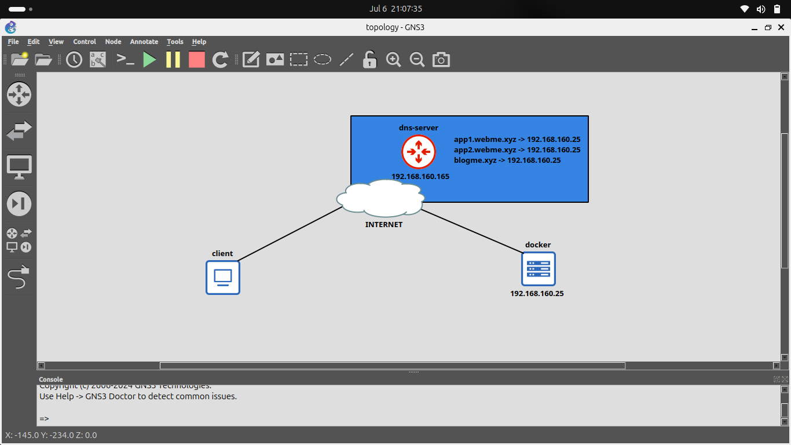
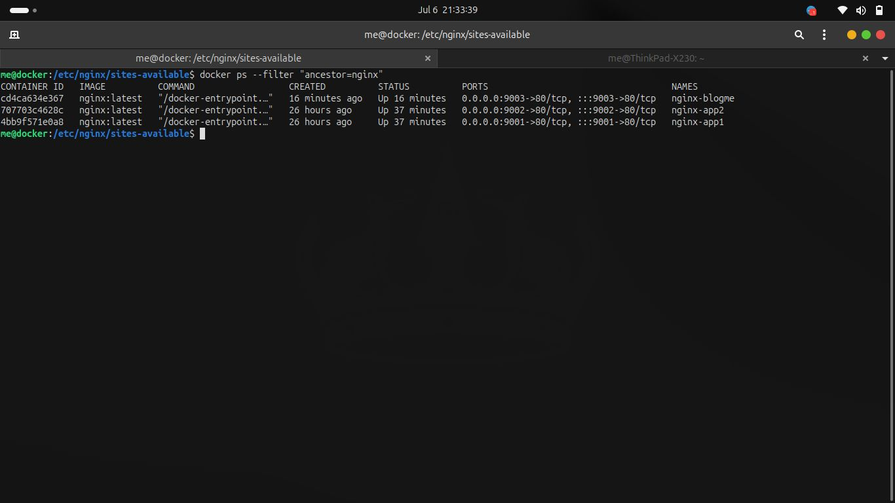
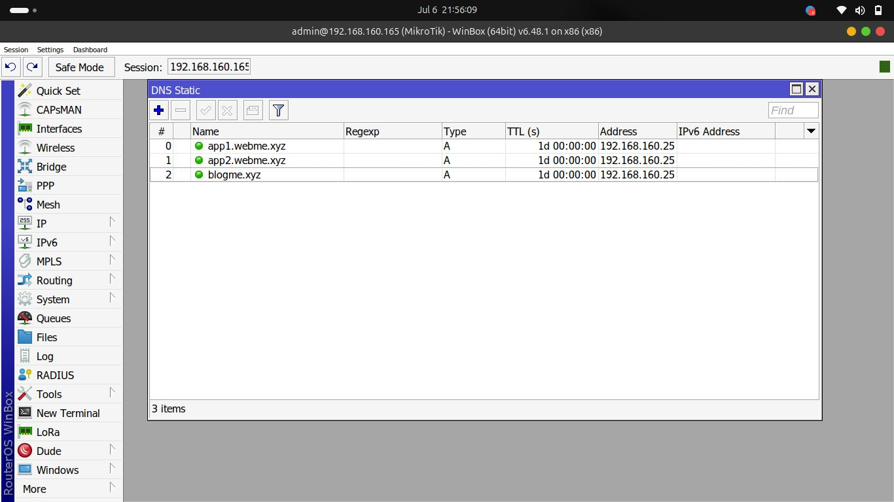
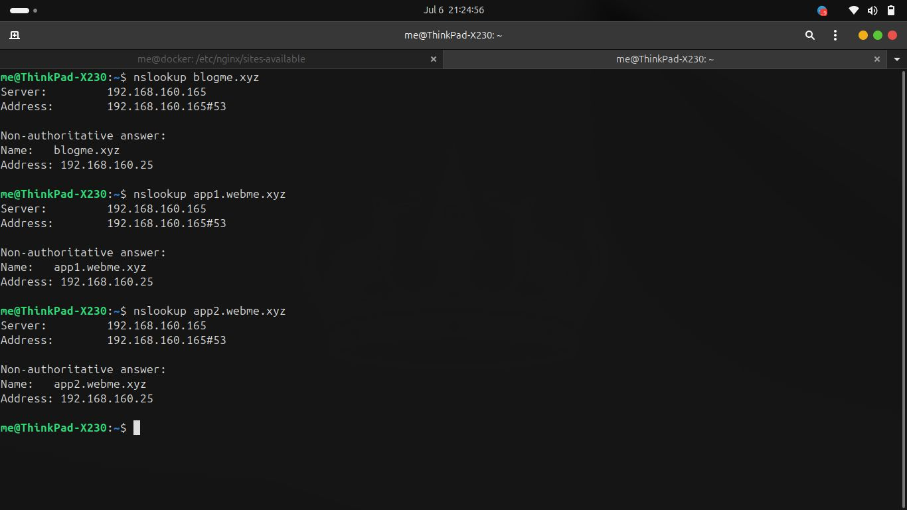
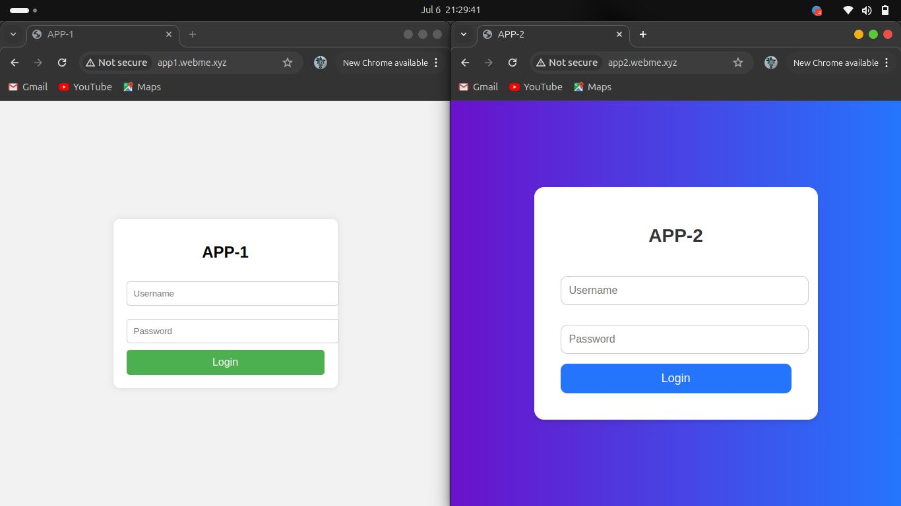

# Deploying Web Apps in Docker Using Nginx Reverse Proxy

This document explains how to deploy multiple web applications running in Docker containers and expose them using Nginx as a reverse proxy. DNS resolution is handled by a MikroTik RouterOS acting as the local DNS server.

---

## Topology

Below is the high-level network topology used in this project:



- **Docker Host** (192.168.160.25)  
  Runs 3 Nginx containers hosting:
  - APP-1  
  - APP-2  
  - BlogMe  

- **DNS Server** (192.168.160.165, MikroTik RouterOS)  
  Resolves:
  - `app1.webme.xyz` → 192.168.160.25  
  - `app2.webme.xyz` → 192.168.160.25  
  - `blogme.xyz` → 192.168.160.25  

- **Client**  
  Accesses the applications through DNS.

---

## Running Docker and Creating Web App Containers

### 1. List of Running Docker Containers

Each container exposes a different port on the Docker host:



Example:
- APP-1 → port **9001**
- APP-2 → port **9002**
- BlogMe → port **9003**

---

## Installing and Configuring Nginx as Reverse Proxy

### 1. Install Nginx

```bash
sudo apt install nginx
```

---

### 2. Remove default configuraton

```bash
cd /etc/nginx
sudo rm sites-enabled/default
sudo rm sites-available/default
```

---

### 3. Create Reverse Proxy Configurations
Create a separate configuration file for each domain:

```bash
sudo nano sites-available/app1.webme.xyz
sudo nano sites-available/app2.webme.xyz
sudo nano sites-available/blogbme.xyz
```

Enable the sites:

```bash
sudo ln -s /etc/nginx/sites-available/app1.webme.xyz /etc/nginx/sites-enabled/
sudo ln -s /etc/nginx/sites-available/app2.webme.xyz /etc/nginx/sites-enabled/
sudo ln -s /etc/nginx/sites-available/blogme.xyz /etc/nginx/sites-enabled/
```

---

### 4. Validate Nginx configuration and restart the service

Validate the configuration:

```bash
sudo nginx -t
```

Expected output:

```
nginx: the configuration file /etc/nginx/nginx.conf syntax is ok
nginx: configuration file /etc/nginx/nginx.conf test is successful
```

Restart and check the service status:

```bash
sudo systemctl restart nginx.service
sudo systemctl status nginx.service
```

Example status output:

```
● nginx.service - A high performance web server and a reverse proxy server
    Loaded: loaded (/lib/systemd/system/nginx.service; enabled; vendor preset: enabled)
    Active: active (running) since Sat 2024-07-06 14:47:46 UTC
  Main PID: 2680 (nginx)
     Tasks: 3
    Memory: 3.3M
```

If the service is not "active", view recent logs for troubleshooting:

```bash
sudo journalctl -u nginx.service --no-pager -n 200
```

---

## Testing

---

### 1. Verify DNS Records

Before accessing the applications through their domain names, ensure that the DNS server is correctly resolving each domain to the Docker host's IP address.

#### DNS Records on the DNS Server
The DNS server (MikroTik RouterOS) should contain A records pointing to the Docker VM:


---

#### Validate DNS Resolution Using nslookup
From the client machine, run:
All domains must resolve to 192.168.160.25, which is the IP address of the Docker server:


---

### 2. Access Web Applications Using DNS

After confirming that all DNS records point to the correct Docker host IP, access each web application using its domain name.

#### ▶ Accessing **blogme.xyz**


#### ▶ Accessing **app1.webme.xyz** and **app2.webme.xyz**


---


## Devices

- **Docker**: Ubuntu 20.04 VM(1vCPU , 4GB RAM)
- **DNS Server**: MikroTik RouterOS 6.48.1

---

## Links

Origin : 
<https://github.com/andre4freelance/docker-and-nginx-reverse-proxy>

Linkedin post : 
<https://www.linkedin.com/posts/link-andre-bastian_networking-docker-devops-activity-7215377666185576448--2nR?utm_source=share&utm_medium=member_desktop&rcm=ACoAAD73JlUBty-p-mBfMEW0-O4j0sv-e_PRQvc>

Facebook post :
<https://www.facebook.com/share/p/1ZVNJrx4qu/>